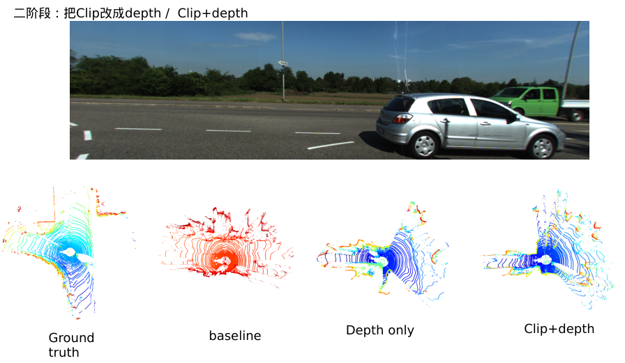

# img2depth2Lidar

This project is an extension of the [LiDAR-Diffusion](https://github.com/hancyran/LiDAR-Diffusion), enhanced by the integration of [Depth-Anything-V2](https://github.com/DepthAnything/Depth-Anything-V2). The goal is to improve performance and functionality in [specific area] through the modifications and improvements made.

# first stage -- add curve loss

# second stage -- CLIP+depth-anything

